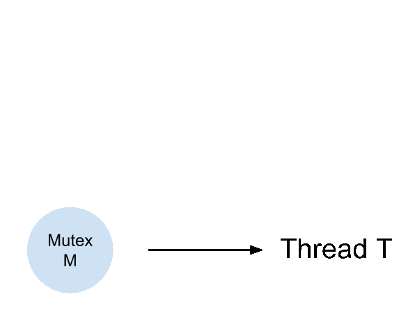

# ABC: AudioBehaviorCheck

This is used to test the behaviors of CoreAudio APIs.
It's originally imported from [my gist post][gist].

## How to use
Clone this repo and run ```$ make all```.
You can use ```$ make clean```

## TODO
- Implement a state callback to notify _started_, _stopped_, or _drained_
  - Maybe we should turn ```AudioStream``` into _FSM_ style
- Enable *input* for ```AudioStream```
- Try using AudioUnit with only *Output* scope
- Try using AudioUnit with only *Input* scope
- Try using AudioUnit with both *Input* and *Output* scopes
- Try using ```kAudioUnitSubType_VoiceProcessingIO``` in AudioUnit
  and see what the differences are from the above.
- Able to let DeviceChangeCallback to notify users what exact change is
- Need to find a way to fire device-added/removed events without
  manually unplugging/plugging devices (Is it possible?).
  - Mayube we need to find a way to fake a device and then add or remove it
- Test some APIs that might use mutex inside AudioUnit in *test_deadlock.cpp*
  and see if they will lead to a deadlock.
  The candidates are ```AudioUnitGetProperty``` and ```AudioUnitSetProperty```.
- Implement a *AudioUnitUtils* to call ```AudioUnitGetProperty``` and ```AudioUnitSetProperty``` on common things.
- Replace ```pthread``` by ```std::thread```
- Wrap native ```AudioObjectGetPropertyData``` to out custom GetData API
- Change style: remove prefix `a` in all arguments
- Put all ```AudioObjectPropertyAddress``` into a common header.
- Splpit tests in ```test_utils.cpp``` into smaller chunks.
- Rename *AudioObjectUtils* into *AudioDeviceInternalUtils* and
  create an new module named *AudioObjectUtils* to write some common used API
  based on *AudioDeviceInternalUtils*.

## Tests

### ```test_audio.cpp```
Play a sine wave

### ```test_deadlock.cpp```
Prove there is a *mutex* **inside** ```AudioUnit```. It will lead to a deadlock if we don't use it carefully (that's why I wrote the original [gist post][gist].).

I think the ```AudioUnitGetProperty``` and ```AudioUnitSetProperty``` might use the same *mutex* that ```AudioComponentFindNext``` or ```AudioComponentInstanceNew``` use. It's reasonable to guess that the ```AudioUnit``` cannot be changed at the same time by different threads.

#### Deadlock



### ```test_listener.cpp```
Test for listening device-changed events.

### ```test_utils.cpp```
Test to get device-related information.

[gist]: https://gist.github.com/ChunMinChang/47b8712ed57b96721eec18dede39d2f9 "Note for coreaudio"
